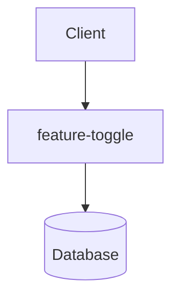

# feature-toggle Architecture

## Overview
This document describes the high-level architecture of `feature-toggle`.

## System Design

## Key Components
- **API Layer**: Handles incoming requests.
- **Service Layer**: Core business logic.
- **Data Access**: Manages persistent storage.
